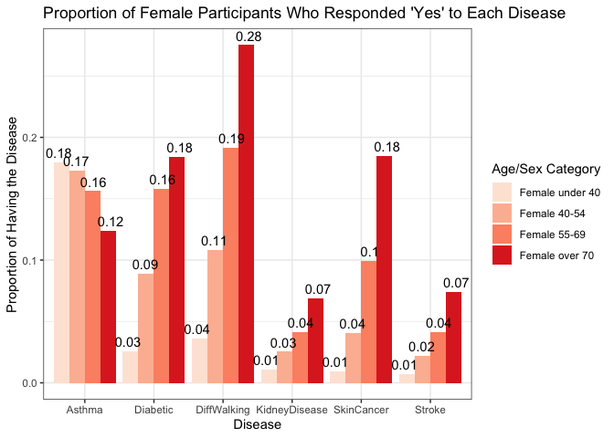

Personal-Key-Indicators-of-Heart-Disease
================
Buning(Erica) Fan, Jun Ren, Anqi Luo, Jinghan(Tracy) Cui
2023-04-12

# Abstract

The purpose of this study is to investigate the relationship between
heart disease and various factors. Specifically, our research divided
our investigation into three aspects: age and sex, BMI, and race. For
each aspect, our research analyzed categories including people’s
behaviors in their daily lives, their pre-existing medical conditions,
and self-ratings to explore their relationship with heart disease. In
the Age and Sex aspect, we divided the sample into eight groups based on
age and gender, and within each group, we scored their behaviors and
diseases to visualize the relationship. In both the BMI (body mass
index) and Race aspects, we explored the potential relationship with
heart disease. Our project used data visualization techniques throughout
our study to effectively present our findings. To avoid subjectivity by
only relying on the score, the research included a logistic regression
model at the end to better summarize our findings.

# Introduction

Heart disease is a major cause of morbidity and mortality worldwide, and
its incidence has been increasing rapidly in recent years. Various
factors such as age, gender, lifestyle, and pre-existing medical
conditions can significantly impact the development of heart disease.
Understanding the relationship between these factors is crucial for
identifying effective prevention and treatment strategies.

In this project, our team wants to investigate how different variables
(BMI, race, smoking, alcohol drinking, physical activity, Asthma,
Diabetic, Difficulty of Walking, Kidney Disease, Skin Cancer, and
Stroke, physical health, mental health, sex, and age group) affect the
probability of having heart diseases. To achieve this, we will use the
Key Indicators of Heart Disease dataset from the CDC, which consists of
survey data from 400k adults related to their health status.

Our main questions include: How do behavioral habits and pre-existing
medical conditions impact the incidence of heart disease? How does age
and gender affect the relationship between behavioral habits,
pre-existing medical conditions, and heart disease incidence? What is
the relationship between BMI and heart disease incidence, and how does
this vary across age, gender, and race? How do different races and
ethnicities vary in their incidence of heart disease and their risk
factors? What recommendations can we provide for patients on how to
prevent heart disease based on these key indicators?

# Data & Methods

## Data

- The dataset comes from the CDC and is a major part of the Behavioral
  Risk Factor Surveillance System (BRFSS), which conducts annual
  telephone surveys to gather data on the health status of U.S.
  residents. As the CDC describes: “Established in 1984 with 15 states,
  BRFSS now collects data in all 50 states as well as the District of
  Columbia and three U.S. territories. BRFSS completes more than 400,000
  adult interviews each year, making it the largest continuously
  conducted health survey system in the world.”. The most recent dataset
  (as of February 15, 2022) includes data from 2020. It consists of
  401,958 rows and 279 columns.

- URL:
  <https://www.kaggle.com/datasets/kamilpytlak/personal-key-indicators-of-heart-disease>
  Personal Key Indicators of Heart Disease \| Kaggle

- Variables:

  - HeartDisease - target trait.

  - Sex - gender of a person.

  - AgeCategory - age category of the subjects.

  - BMI - a value derived from the mass and height of a person.

  - Race - imputed race/ethnicity value.

  - Behaviors:

    - Smoking - whether the participant has smoking.

    - AlcoholDrinking - whether the participant has alcohol drinking.

    - Physical Activity - participants who have physical activity in the
      past month.

  - Other Disease:

    - Stroke - Ischemic stroke occurs 4 times more often than
      hemorrhagic.

    - DiffWalking - difficulty climbing stairs.

    - Diabetic - whether the participant has diabetes before/now.

    - Asthma - whether the participant has asthma before/now.

    - KidneyDisease - Whether the participant had kidney disease
      before/now (Not including kidney stones, bladder infection or
      incontinence).

    - Skin Cancer - whether the participant has skin cancer before/now.

  - PhysicalHealth - number of days in a month of feeling poor physical
    health.

  - MentalHealth - number of days in a month of feeling poor mental
    health.

  - GenHealth - individual general health rate.

  - SleepTime - average number of hours of sleep in a 24-hour period.

## Method

Overall, the data is summarized into three big groups: AgeCategory/Sex,
BMI, and Race. We use these three different aspects to find out the
relationship between each of those three aspects and heart disease.

### In Age Category & Sex aspect:

We are currently categorizing various factors into four groups:
behavioral habits, diseases, self-assessment of physical and mental
health, and BMI. To assess the overall effect, we are scoring the
behavioral habits and diseases separately before adding the scores. This
approach allows us to differentiate the contributions of lifestyle
choices, pre-existing medical conditions, and individuals’ perceptions
of their health to the outcome. However, since self-assessment is based
on individuals’ subjective experiences of their physical and mental
health issues within a 30-day period, we have decided not to include
self-assessment scores in the same manner as the other two groups for
our analysis. This is because these scores may be less objective, as
personal perceptions can vary and be influenced by multiple factors.
Similarly, we are considering BMI based on the individual’s situation
related to their mass and height. The categorization of those key
indicators are:

1.  Behavior: Smoking; Alcohol Drinking; Physical Activity
2.  Disease: Stroke; Diff Walking; Diabetic; Asthma; Kidney Disease;
    Skin Cancer
3.  Self-assessment: Physical Health; Mental Health
4.  BMI

#### Evaluation of Behaviors & Diseases

For each age and gender category, the data are organized by behavioral
and morbidity classifications. We intend to evaluate both behavioral and
morbidity classifications. Within each classification, we calculate and
depict the proportion of individuals who have or have not engaged in any
specific behavior or experienced any disease using graphs.
Behaviors/diseases are categorized as positive or negative. Each
behavior/disease is assigned a proportional value, ranging from 0 to 1.
The evaluation for each category results from the sum of its contained
behaviors/diseases.

- Since the range of proportional values for behaviors is from 0 to 0.6,
  we have divided the proportional value range into six equal intervals
  for Smoking, AlcoholDrinking, and PhysicalActivity. Each interval
  corresponds to a point on the scale:

<!-- -->

    ##   Proportional_Value Corresponding_Score
    ## 1            0 - 0.1                   6
    ## 2          0.1 - 0.2                   5
    ## 3          0.2 - 0.3                   4
    ## 4          0.3 - 0.4                   3
    ## 5          0.4 - 0.5                   2
    ## 6          0.5 - 0.6                   1

- The proportional values for diseases (Stroke, DiffWalking, Diabetic,
  Asthma, KidneyDisease, Skin Cancer) are set into six values ranging
  from 0 to 0.3. As these values are all less than 0.4, each
  corresponding point is set below this threshold:

<!-- -->

    ##   Proportional_Value Corresponding_Score
    ## 1           0 - 0.05                   6
    ## 2         0.05 - 0.1                   5
    ## 3         0.1 - 0.15                   4
    ## 4         0.15 - 0.2                   3
    ## 5         0.2 - 0.25                   2
    ## 6         0.25 - 0.3                   1

We evaluated each classification and recorded the evaluation score for
each behavior and disease. After obtaining the scores for these two
categories, we compared the relationship between the behavior/disease
scores and the age category. Once we identified the trend of the scores,
we then compared the relationship between the proportion of heart
disease and age category to observe their correlation. Additionally, we
also analyzed the relationship between self-assessment and BMI with
AgeCategory/Sex to determine their respective associations.

### In BMI aspect:

In the second part of our study, we aimed to investigate the
relationship between BMI and other aspects. In the 1990s, the World
Health Organization (WHO) introduced the concept of BMI, which defines a
BMI less than 18.5 as underweight, 18 to 24 as healthy weight, 25 to 30
as overweight, and over 30 as obese. Using this definition, we divided
BMI values into several groups: 10-18; 18-24; 24-29; 29-34; 34-39;
39-45; 45-50; 50-60; and 60 to infinity.

Following the same category in Age Category & Sex aspect, we keep using
the same categories of behaviors and other diseases and compare those
two proportional values with BMI values. We calculate the mean of each
proportional classifications in behaviors(Smoking, PhysicalActivity,
AlcoholDrinking) and diseases(HeartDisease, Stroke, Diffwalking,
Diabetic, Asthma, KidneyDisease, SkinCancer). We observe the
relationship between BMI and Behaviors and Diseases by line plots. We
also particularly check the relationship between BMI and heart disease
by dot plot.

### In Race aspect:

The third part aims to investigate the relationship between race and
heart disease, which is an interesting fact. The race aspect is divided
into six categories: American Indian/Alaskan Native, Asian, Black,
Hispanic, White, and Other. We imported the data of the number of people
who have heart disease in each category and analyzed if race has any
influence on heart disease. We used dot plots and covariance graphs for
this analysis.

## Data importing and cleaning

### Set Up and Import Data

### Filter out NA Data

### Change Yes/No Response to 1/0

    ##   HeartDisease   BMI Smoking AlcoholDrinking Stroke PhysicalHealth MentalHealth
    ## 1            0 16.60       1               0      0              3           30
    ## 2            0 20.34       0               0      1              0            0
    ## 3            0 26.58       1               0      0             20           30
    ## 4            0 24.21       0               0      0              0            0
    ## 5            0 23.71       0               0      0             28            0
    ## 6            1 28.87       1               0      0              6            0
    ##   DiffWalking    Sex AgeCategory  Race Diabetic PhysicalActivity GenHealth
    ## 1           0 Female       55-59 White        1                0 Very good
    ## 2           0 Female 80 or older White        0                0 Very good
    ## 3           0   Male       65-69 White        1                0      Fair
    ## 4           0 Female       75-79 White        0                1      Good
    ## 5           1 Female       40-44 White        0                0 Very good
    ## 6           1 Female       75-79 Black        0                1      Fair
    ##   SleepTime Asthma KidneyDisease SkinCancer
    ## 1         5      1             0          1
    ## 2         7      0             0          0
    ## 3         8      1             0          0
    ## 4         6      0             0          1
    ## 5         8      0             0          0
    ## 6        12      0             0          0

### Seperate Into 8 Different Group Based on Age and Sex

### Create 8 Group Tables

# Results

## In Age Category & Sex aspect:

### Female Behaviors

<!-- -->

### Male Behaviors

<!-- -->

The proportional values of the behavioral category are presented by bar
graphs in the female and male categories. The red trend represents the
female behavioral category, and the blue trend represents the male
behavioral category. Throughout both bar graphs, the overall trend
between females and males is similar. In the female graph, the
proportion of physical activity for females has an increasing trend. The
proportion of smoking for females also has an increasing trend at first,
but it decreases when the age of females is over 70. In the male graph,
both proportions of physical activity and smoking continue to increase
as they get older.

### Female Disease

<!-- -->

### Male Disease

<!-- -->

The two bar graphs represent the proportion of both female and male
participants who have particular diseases. Same with the behavior
graphs: the red trend represents the female, and the blue trend
represents the male. Both graphs are similar in their tendency. The
proportion of participants with asthma in both females and males
presents a decreasing tendency as they get older. All of the other
diseases (Diabetes, Difficulty walking, Kidney Disease, Skin Cancer,
Stroke) show an upward trend as the participants get older.

Based on the evaluation rubric presented in the methods section, we have
calculated the evaluation scores for each behavioral and disease
category by Age/Sex category. The evaluation scores are obtained by
summing up the corresponding points for each category. The detailed
evaluation results are presented in the following table.

### Evaluate Each Group and Collect Score

    ##             Group Behavior_Score Disease_Score Total_Score
    ## 1 Female under 40             15            33          48
    ## 2    Female 40-54             13            30          43
    ## 3    Female 55-69             12            26          38
    ## 4  Female over 70             12            21          33
    ## 5   Male under 40             14            34          48
    ## 6      Male 40-54             13            32          45
    ## 7      Male 55-69             12            26          38
    ## 8    Male over 70             11            19          30

<!-- -->

The total scores indicate that younger age groups have the highest
scores, whereas older age groups have the lowest scores. Furthermore,
both male and female groups over 70 years of age have the lowest scores
compared to their counterparts in other age groups.

We created three line graphs, including the behavior score, disease
score, and total score by Age/Sex Category to illustrate the trends in
the scores. The graphs indicate that the behavior score for both females
and males across different Age/Sex categories only slightly decreases.
The disease score, however, exhibits an apparent decline as the age of
both females and males increases, as shown by the total score graph.
Additionally, there is no significant difference between the male and
female lines in the three line plots.

### Physical Health Rating

<!-- -->

### Mental Health Rating

<!-- -->

The two line plots depict the trends in individual physical and mental
health ratings over a 30-day period. The data presented in the plots
represent the average ratings reported by individuals who have reported
experiencing physical or mental health problems in a given month, for
both males and females. The first plot displays the average rating of
physical health, which shows an observable increasing trend for both
genders, indicating that individuals feel they have more physical
problems as they age. The second plot displays the average rating of
mental health, which has an inverse trend as compared to the physical
health plot. The trend line shows that individuals feel they have fewer
mental health problems as they age. However, the average score for
females is consistently higher than that for males, indicating that
females tend to feel they have more physical and mental health issues
than males.

### Different Group & Sleeptime

<!-- -->

The box plot above shows sleep time by Age/Sex Category. The plot
indicates that there is no significant trend in sleep time, with only a
slight increase observed among older age groups for both males and
females.

### Different Groups & BMI

<!-- -->

Moreover, the box plot shows the summary of BMI across different age and
sex categories. The trend appears to be unclear and random, with no
clear pattern or tendency observed.

### Proportion of Getting Heart Disease in Different Age Group

<!-- -->

The line graph illustrates the relationship between age and the
proportion of individuals with heart disease, with separate lines for
males and females. The overall pattern indicates an upward trend,
suggesting an increase in the risk of developing heart disease with age
for both sexes. However, there are notable differences in the rate of
increase between males and females. Specifically, the graph reveals that
the proportional values of heart disease for both genders are similar
for those under 40. Beyond that point, the prevalence of heart disease
in males increases at a higher rate, suggesting that males may be more
susceptible to the condition as they age.

## In BMI aspect:

### BMI and Behavior

<!-- -->

The line graph displays the relationship between three behaviors
(Alcohol Drinking, Smoking, and No Physical Activity) and different
ranges of BMI. The graph reveals that when BMI is in the healthy range
of 18-24, people tend to have a lower proportion of smoking and no
physical activity. However, as BMI increases from 24 to infinity, the
proportion of people who do not engage in physical activity increases,
while the trend in proportion of smokers remains relatively unchanged.
Additionally, the trend for alcohol consumption shows no significant
change across all BMI ranges, suggesting that there may be no strong
correlation between alcohol consumption and BMI in this dataset.

Therefore, the graph suggests that as BMI moves into the healthy range,
people tend to have a greater level of physical activity and smoke less.
As BMI increases, people tend to become less physically active, which
may contribute to higher rates of obesity and other health issues.
Additionally, the lack of a significant correlation between alcohol
consumption and BMI suggests that other factors may also influence
smoking.

### BMI and Other Diseases

<!-- -->

This line graph shows the proportion of people with different BMI ranges
who have been diagnosed with Asthma, Diabetic, Difficulty of Walking,
Heart Disease, Kidney Disease, Skin Cancer, and Stroke. The plot reveals
interesting insights about the relationship between BMI and diseases.
When the BMI is in the range of 18-24, the proportion of people with all
diseases, except for Skin Cancer, is lower. This suggests that
maintaining a healthy weight in this BMI range could help reduce the
risk of developing these diseases. Also, as the BMI increases from 24 to
infinity, the proportion of people who have Asthma, Diabetic, Difficulty
of Walking, Heart Disease, Kidney Disease, and Stroke increases, with
the highest increase observed in Asthma, Diabetic, and Difficulty of
Walking. This indicates that being overweight or obese in this range can
significantly increase the risk of developing these diseases. However,
the only disease that shows a decreasing trend with increasing BMI is
Skin Cancer. The reason might because that people with higher BMIs tend
to have more subcutaneous fat, which provides natural protection against
the harmful effects of UV radiation from the sun.

### BMI and HeartDisease

<!-- -->

This plot takes a closer look at the proportion of getting Heart Disease
as the BMI grows. The plot indicates that when BMI is in the range of
18-24, the proportion of getting Heart Disease is relatively low, around
0.06. As BMI increases, the proportion of getting Heart Disease also
increases, and this relationship appears to be approximately linear.
This means that as BMI increases, the risk of getting Heart Disease
increases as well.

Overall, these three plots highlight the people with a healthy BMI tend
to have a healthier lifestyle and the importance of maintaining a
healthy weight in the BMI range of 18-24 to reduce the risk of
developing various diseases. It also underscores the need for early
intervention and preventative measures for people with BMIs in the
overweight and obese range to prevent the onset of chronic diseases.

## In Race aspects:

### Proportion of Getting Heart Disease for Different Races and Age Groups

<!-- -->

The plot depicts the covariation between race and the proportion of
individuals with heart disease as they age. As expected, the plot shows
that the proportion of people getting heart disease increases as age
increases, indicated by the darkening color of the plot for all races.
However, notable differences are observed among different races. The
plot suggests that the Asian race tends to have a lighter color,
indicating a lower proportion of people getting heart disease compared
to other races. In contrast, the American Indian/Alaskan Native race
tends to have a slightly darker color, suggesting a slightly higher
proportion of people getting heart disease compared to other races.

### Race and Heart Disease

<!-- -->

We also draw a dot plot that only shows the relationship between
different races and the proportion of getting heart disease. It also
appears that there are significant differences between the races with
respect to the proportion of getting heart disease. The plot reveals
that Asian individuals tend to have a lower proportion of getting heart
disease compared to all the other races. This is followed by Hispanic,
Black, Other, White, and American Indian/Alaskan Native, respectively.
The American Indian/Alaskan Native population has the highest proportion
of getting heart disease.

Overall, both plots suggest that race may play a role in the proportion
of people getting heart disease as age grows. Further investigation may
be needed to understand the underlying factors that contribute to this
difference in risk between different races.

## Regression:

### Logistic Regression Model

    ## 
    ## Call:
    ## glm(formula = reg_formula, family = binomial(link = "logit"), 
    ##     data = data)
    ## 
    ## Deviance Residuals: 
    ##     Min       1Q   Median       3Q      Max  
    ## -2.1677  -0.4097  -0.2479  -0.1325   3.5688  
    ## 
    ## Coefficients:
    ##                       Estimate Std. Error z value Pr(>|z|)    
    ## (Intercept)         -4.8177061  0.0751062 -64.145  < 2e-16 ***
    ## BMI                  0.0055948  0.0011296   4.953 7.31e-07 ***
    ## SleepTime           -0.0189649  0.0043166  -4.393 1.12e-05 ***
    ## Smoking              0.3468600  0.0143131  24.234  < 2e-16 ***
    ## AlcoholDrinking     -0.2666173  0.0334649  -7.967 1.62e-15 ***
    ## PhysicalActivity    -0.0009081  0.0160227  -0.057 0.954801    
    ## DiffWalking          0.2535073  0.0180714  14.028  < 2e-16 ***
    ## Diabetic             0.4730288  0.0165336  28.610  < 2e-16 ***
    ## Asthma               0.2570216  0.0191643  13.411  < 2e-16 ***
    ## KidneyDisease        0.5808421  0.0243798  23.825  < 2e-16 ***
    ## SkinCancer           0.1588855  0.0194081   8.187 2.69e-16 ***
    ## Stroke               1.0649949  0.0226091  47.105  < 2e-16 ***
    ## PhysicalHealth       0.0028226  0.0008625   3.273 0.001066 ** 
    ## MentalHealth         0.0029308  0.0008802   3.330 0.000869 ***
    ## AgeCategory55-69     0.8022104  0.0238440  33.644  < 2e-16 ***
    ## AgeCategoryover 70   1.4949696  0.0243807  61.318  < 2e-16 ***
    ## AgeCategoryunder 40 -1.0671154  0.0417491 -25.560  < 2e-16 ***
    ## SexMale              0.6937524  0.0144739  47.931  < 2e-16 ***
    ## RaceAsian           -0.5315013  0.0839007  -6.335 2.38e-10 ***
    ## RaceBlack           -0.3321259  0.0576402  -5.762 8.31e-09 ***
    ## RaceHispanic        -0.2636667  0.0586911  -4.492 7.04e-06 ***
    ## RaceOther           -0.0525229  0.0638592  -0.822 0.410804    
    ## RaceWhite           -0.0528533  0.0514730  -1.027 0.304508    
    ## GenHealthFair        1.5505052  0.0328069  47.261  < 2e-16 ***
    ## GenHealthGood        1.0759207  0.0295318  36.433  < 2e-16 ***
    ## GenHealthPoor        1.9267236  0.0408879  47.122  < 2e-16 ***
    ## GenHealthVery good   0.4887507  0.0303156  16.122  < 2e-16 ***
    ## ---
    ## Signif. codes:  0 '***' 0.001 '**' 0.01 '*' 0.05 '.' 0.1 ' ' 1
    ## 
    ## (Dispersion parameter for binomial family taken to be 1)
    ## 
    ##     Null deviance: 186906  on 319794  degrees of freedom
    ## Residual deviance: 146063  on 319768  degrees of freedom
    ## AIC: 146117
    ## 
    ## Number of Fisher Scoring iterations: 7

Since there are two continuous variables (BMI and SleepTime), two
discrete variables (PhysicalHealth and MentalHealth), and all other
variables being categorical, we fitted a logistic regression model to
the data, which we refer to as the full model. By comparing the p-values
of each predictor to an alpha value of 0.05, we can conclude that the
significant predictors in this model include BMI, SleepTime, Smoking,
AlcoholDrinking, DiffWalking, Diabetic, Asthma, KidneyDisease,
SkinCancer, Stroke, PhysicalHealth, MentalHealth, AgeCategory, Sex, and
Race.

### Variable Selection

    ## 
    ## Attaching package: 'MASS'

    ## The following object is masked from 'package:dplyr':
    ## 
    ##     select

    ## Start:  AIC=146116.8
    ## HeartDisease ~ BMI + SleepTime + Smoking + AlcoholDrinking + 
    ##     PhysicalActivity + DiffWalking + Diabetic + Asthma + KidneyDisease + 
    ##     SkinCancer + Stroke + PhysicalHealth + MentalHealth + AgeCategory + 
    ##     Sex + Race + GenHealth
    ## 
    ##                    Df Deviance    AIC
    ## - PhysicalActivity  1   146063 146115
    ## <none>                  146063 146117
    ## - PhysicalHealth    1   146073 146125
    ## - MentalHealth      1   146074 146126
    ## - SleepTime         1   146082 146134
    ## - BMI               1   146087 146139
    ## - SkinCancer        1   146129 146181
    ## - AlcoholDrinking   1   146130 146182
    ## - Asthma            1   146237 146289
    ## - Race              5   146249 146293
    ## - DiffWalking       1   146257 146309
    ## - KidneyDisease     1   146602 146654
    ## - Smoking           1   146652 146704
    ## - Diabetic          1   146857 146909
    ## - Stroke            1   148124 148176
    ## - Sex               1   148416 148468
    ## - GenHealth         4   149824 149870
    ## - AgeCategory       3   154793 154841
    ## 
    ## Step:  AIC=146114.8
    ## HeartDisease ~ BMI + SleepTime + Smoking + AlcoholDrinking + 
    ##     DiffWalking + Diabetic + Asthma + KidneyDisease + SkinCancer + 
    ##     Stroke + PhysicalHealth + MentalHealth + AgeCategory + Sex + 
    ##     Race + GenHealth
    ## 
    ##                    Df Deviance    AIC
    ## <none>                  146063 146115
    ## + PhysicalActivity  1   146063 146117
    ## - PhysicalHealth    1   146073 146123
    ## - MentalHealth      1   146074 146124
    ## - SleepTime         1   146082 146132
    ## - BMI               1   146087 146137
    ## - SkinCancer        1   146129 146179
    ## - AlcoholDrinking   1   146130 146180
    ## - Asthma            1   146237 146287
    ## - Race              5   146249 146291
    ## - DiffWalking       1   146261 146311
    ## - KidneyDisease     1   146602 146652
    ## - Smoking           1   146653 146703
    ## - Diabetic          1   146857 146907
    ## - Stroke            1   148124 148174
    ## - Sex               1   148423 148473
    ## - GenHealth         4   149878 149922
    ## - AgeCategory       3   154820 154866

    ## 
    ## Call:
    ## glm(formula = HeartDisease ~ BMI + SleepTime + Smoking + AlcoholDrinking + 
    ##     DiffWalking + Diabetic + Asthma + KidneyDisease + SkinCancer + 
    ##     Stroke + PhysicalHealth + MentalHealth + AgeCategory + Sex + 
    ##     Race + GenHealth, family = binomial(link = "logit"), data = data)
    ## 
    ## Deviance Residuals: 
    ##     Min       1Q   Median       3Q      Max  
    ## -2.1678  -0.4097  -0.2479  -0.1325   3.5688  
    ## 
    ## Coefficients:
    ##                       Estimate Std. Error z value Pr(>|z|)    
    ## (Intercept)         -4.8176337  0.0750951 -64.154  < 2e-16 ***
    ## BMI                  0.0055895  0.0011257   4.965 6.87e-07 ***
    ## SleepTime           -0.0189696  0.0043158  -4.395 1.11e-05 ***
    ## Smoking              0.3468245  0.0142994  24.255  < 2e-16 ***
    ## AlcoholDrinking     -0.2666262  0.0334646  -7.967 1.62e-15 ***
    ## DiffWalking          0.2533482  0.0178519  14.192  < 2e-16 ***
    ## Diabetic             0.4730041  0.0165278  28.619  < 2e-16 ***
    ## Asthma               0.2570335  0.0191632  13.413  < 2e-16 ***
    ## KidneyDisease        0.5808275  0.0243784  23.825  < 2e-16 ***
    ## SkinCancer           0.1589218  0.0193975   8.193 2.55e-16 ***
    ## Stroke               1.0649876  0.0226087  47.105  < 2e-16 ***
    ## PhysicalHealth       0.0028196  0.0008609   3.275  0.00106 ** 
    ## MentalHealth         0.0029297  0.0008799   3.329  0.00087 ***
    ## AgeCategory55-69     0.8021978  0.0238430  33.645  < 2e-16 ***
    ## AgeCategoryover 70   1.4949161  0.0243624  61.362  < 2e-16 ***
    ## AgeCategoryunder 40 -1.0670932  0.0417472 -25.561  < 2e-16 ***
    ## SexMale              0.6937957  0.0144537  48.001  < 2e-16 ***
    ## RaceAsian           -0.5314859  0.0839001  -6.335 2.38e-10 ***
    ## RaceBlack           -0.3321275  0.0576402  -5.762 8.31e-09 ***
    ## RaceHispanic        -0.2637083  0.0586865  -4.494 7.01e-06 ***
    ## RaceOther           -0.0525011  0.0638580  -0.822  0.41099    
    ## RaceWhite           -0.0528421  0.0514727  -1.027  0.30461    
    ## GenHealthFair        1.5503562  0.0327014  47.409  < 2e-16 ***
    ## GenHealthGood        1.0758360  0.0294939  36.477  < 2e-16 ***
    ## GenHealthPoor        1.9265060  0.0407072  47.326  < 2e-16 ***
    ## GenHealthVery good   0.4887318  0.0303138  16.122  < 2e-16 ***
    ## ---
    ## Signif. codes:  0 '***' 0.001 '**' 0.01 '*' 0.05 '.' 0.1 ' ' 1
    ## 
    ## (Dispersion parameter for binomial family taken to be 1)
    ## 
    ##     Null deviance: 186906  on 319794  degrees of freedom
    ## Residual deviance: 146063  on 319769  degrees of freedom
    ## AIC: 146115
    ## 
    ## Number of Fisher Scoring iterations: 7

To exclude all redundant variables in the model and improve its
performance, we performed a stepwise variable selection using AIC as a
criterion. The stepwise model removed PhysicalHealth, and all other
predictors remained.

The deviance residuals provide a measure of the goodness-of-fit of the
model. Smaller deviance residuals generally indicate better fit.
According to the output, the residual deviance of our model is 146,063,
while the null deviance is 186,906. This suggests that the model fits
the data better than a model without any predictors.

Also, since smaller values of AIC indicate a better balance between fit
and complexity. In the stepwise model, the AIC is 146,115 which is
smaller compared to that of the full model.

### Check for multicollinearity using Variance Inflation Factor (VIF)

    ## Loading required package: carData

    ## 
    ## Attaching package: 'car'

    ## The following object is masked from 'package:purrr':
    ## 
    ##     some

    ## The following object is masked from 'package:dplyr':
    ## 
    ##     recode

    ##                     GVIF Df GVIF^(1/(2*Df))
    ## BMI             1.158212  1        1.076203
    ## SleepTime       1.040799  1        1.020196
    ## Smoking         1.048220  1        1.023826
    ## AlcoholDrinking 1.019248  1        1.009578
    ## DiffWalking     1.415870  1        1.189903
    ## Diabetic        1.139700  1        1.067567
    ## Asthma          1.058536  1        1.028852
    ## KidneyDisease   1.050246  1        1.024815
    ## SkinCancer      1.075526  1        1.037076
    ## Stroke          1.036318  1        1.017997
    ## PhysicalHealth  1.801000  1        1.342013
    ## MentalHealth    1.235103  1        1.111352
    ## AgeCategory     1.242345  3        1.036829
    ## Sex             1.066461  1        1.032696
    ## Race            1.093066  5        1.008938
    ## GenHealth       1.943943  4        1.086639

After calculating the Generalized Variance Inflation Factors (GVIF)
values in the model, we found that the GVIF^(1/(2\*Df)) column provides
the adjusted VIF values for each predictor and all values are less than
10, indicating that multicollinearity is not a significant concern in
our model.

### Model interpretation

    ##         (Intercept)                 BMI           SleepTime             Smoking 
    ##         0.008085898         1.005605133         0.981209142         1.414568460 
    ##     AlcoholDrinking         DiffWalking            Diabetic              Asthma 
    ##         0.765959330         1.288331776         1.604807930         1.293088485 
    ##       KidneyDisease          SkinCancer              Stroke      PhysicalHealth 
    ##         1.787516973         1.172246324         2.900803065         1.002823603 
    ##        MentalHealth    AgeCategory55-69  AgeCategoryover 70 AgeCategoryunder 40 
    ##         1.002933998         2.230437565         4.458962516         0.344007023 
    ##             SexMale           RaceAsian           RaceBlack        RaceHispanic 
    ##         2.001297519         0.587730998         0.717395871         0.768197557 
    ##           RaceOther           RaceWhite       GenHealthFair       GenHealthGood 
    ##         0.948853287         0.948529758         4.713148747         2.932443352 
    ##       GenHealthPoor  GenHealthVery good 
    ##         6.865480368         1.630247465

The odds ratios for each predictor in the stepwise model indicate how
the odds of having heart disease increase or decrease with a one-unit
change in the predictor, holding other predictors constant. For example,
the coefficient of BMI (0.0055895) is positive, suggesting that an
increase in BMI may raise the likelihood of heart disease. Specifically,
we used exp(coef(stepwise_model)) to calculate the odds ratios for each
predictor. For BMI, we computed exp(0.0055895) = 1.005605133, meaning
the odds ratio is approximately 1.005605133. In other words, for every
unit increase in BMI, the odds of heart disease increase by roughly
0.56%. Similarly, the odds ratio for SleepTime is 0.9812, indicating
that for each additional hour of sleep, the odds of having heart disease
decrease by about 1.88%.

By examining the odds ratios, we can determine which predictors have a
more significant impact on the probability of developing heart disease.
This helps identify which groups of people face higher risks of heart
disease and informs strategies to prevent the condition through better
daily habits and other methods. For example, compared to people under 40
who have an odds ratio of 0.344007023, those aged over 70 are more
likely to develop heart disease, with a much higher odds ratio of
4.458962516. Additionally, alcohol consumption (odds ratio 0.765959330)
is not as severe a risk factor as having a stroke, which has the highest
odds ratio among all other diseases at 2.900803065. This means that each
additional stroke increases the odds of heart disease substantially.

### Perform the Likelihood Ratio Test

    ## Analysis of Deviance Table
    ## 
    ## Model 1: HeartDisease ~ BMI + SleepTime + Smoking + AlcoholDrinking + 
    ##     DiffWalking + Diabetic + Asthma + KidneyDisease + SkinCancer + 
    ##     Stroke + PhysicalHealth + MentalHealth + AgeCategory + Sex + 
    ##     Race + GenHealth
    ## Model 2: HeartDisease ~ BMI + SleepTime + Smoking + AlcoholDrinking + 
    ##     PhysicalActivity + DiffWalking + Diabetic + Asthma + KidneyDisease + 
    ##     SkinCancer + Stroke + PhysicalHealth + MentalHealth + AgeCategory + 
    ##     Sex + Race + GenHealth
    ##   Resid. Df Resid. Dev Df  Deviance Pr(>Chi)
    ## 1    319769     146063                      
    ## 2    319768     146063  1 0.0032127   0.9548

Finally, we performed a likelihood ratio test by comparing the stepwise
model with the full model using ANOVA. According to the output, the
p-value is 0.9548, which is greater than the alpha value of 0.05,
indicating that there is no statistically significant difference between
the full model and the stepwise model. Therefore, it can be concluded
that the stepwise model, with fewer predictors, provides a similar
goodness of fit as the full model. This implies that the stepwise model
is more parsimonious and may be preferred over the full model.

# Discussion

Heart disease is a complex and multifactorial condition influenced by a
range of factors such as age, gender, family history, smoking, BMI,
other diseases, physical inactivity, race, and stress. Our study aims to
develop a predictive model to identify the key indicators with the
strongest association with heart disease risk and provide
recommendations for healthcare providers and patients to prevent heart
disease, utilizing the Key Indicators of Heart Disease dataset.

Our goal is to develop a predictive model that can identify the key
indicators with the strongest association with heart disease risk. By
analyzing the available data, we hope to provide recommendations for
healthcare providers and patients to help prevent heart disease.
However, it’s important to acknowledge the limitations of our dataset.

One limitation of our study was the size of the dataset. While we
analyzed a significant amount of data, a larger dataset with more data
points could have provided more robust results. Additionally, the
distribution of different races in our dataset was highly unbalanced,
which might affect the results of the relationship between race and
heart disease. Also, the age section only contained age ranges instead
of specific ages. Further data collection with detailed ages would
enable a more in-depth analysis. Moreover, the dataset contained fewer
data points for individuals under 40, which may have introduced bias
into our analysis. Having too many predictors in the logistic regression
model is also a concern.

Future research should explore the relationship between mental health
issues, such as depression, and heart disease. Expanding data collection
to include a more diverse population worldwide could provide valuable
insights into the multifactorial nature of heart disease. Despite these
limitations, our project has the potential to make a significant
contribution to our understanding of heart disease risk and prevention.
We may also employ feature selection techniques to penalize less
important predictors and select the most relevant ones, and use
cross-validation to get a better estimate of the model’s performance on
unseen data.

To manage heart disease, we recommend people maintain a healthy weight,
exercise regularly, quit smoking, get enough sleep, manage diabetes, and
limit alcohol intake. Healthcare providers can offer personalized advice
to prevent or manage heart disease.

In conclusion, according to the logistic regression model, males are
about 2 times more likely to have heart disease compared to females.
People with behaviors such as smoking, diseases like stroke, and those
aged over 70 with poor general health are more likely to have heart
disease. Our study sheds light on the factors associated with heart
disease and provides some recommendations for prevention. Further
research with a larger and more diverse population is necessary to gain
a more comprehensive understanding of heart disease.

# Appendix

## Set Up and Import Data

``` r
library(tibble)
library(tidyr)
library(readr)
library(dplyr)
library(stringr)
library(ggplot2)
library(tidyverse)
library(knitr)
data <- read.csv("data/heart_2020_cleaned.csv")
```

## Filter out NA Data

``` r
str(data)
summary(data)
data[rowSums((is.na(data))>0),]
na<-function(x){
  result<- which(x=='na'| x=='NA'|x=='Na')
  length(result)
}
apply(data,2,na)
```

## Change Yes/No Response to 1/0

``` r
# creating dummy variables using a function
# change Yes to 1, No to 0
convert_yes_no_to_binary <- function(data, column) {
  for (x in column) {
    data[[x]] <- ifelse(data[[x]] == 'Yes', 1, 0)
  }
  return(data)
}

dummy_variables <- c("HeartDisease", "Smoking", "AlcoholDrinking", "Stroke", "DiffWalking","Diabetic", "Asthma", "KidneyDisease", "SkinCancer")

# physical activity has a relative positive impact, so change Yes to 0, No to 1
data$PhysicalActivity <- ifelse(data$PhysicalActivity == "Yes", 0, 1)

data <- convert_yes_no_to_binary(data, dummy_variables)
head(data)
```

## Seperate Into 8 Different Group Based on Age and Sex

``` r
# check unique values in AgeCategory and Sex
unique(data$AgeCategory)
length(unique(data$AgeCategory))
unique(data$Sex)

# update AgeCategory variable
data <- data %>%
  mutate(AgeCategory = case_when(
    AgeCategory %in% c("18-24", "25-29", "30-34", "35-39") ~ "under 40",
    AgeCategory %in% c("40-44", "45-49", "50-54") ~ "40-54",
    AgeCategory %in% c("55-59", "60-64", "65-69") ~ "55-69",
    AgeCategory %in% c("70-74", "75-79", "80 or older") ~ "over 70",
    TRUE ~ "Unknown"))

# create Combined_AgeSexCategory variable using AgeCategory and Sex
data <- data %>%
  mutate(Combined_AgeSexCategory = case_when(
    AgeCategory == "under 40" & Sex == "Female" ~ "Female under 40",
    AgeCategory == "under 40" & Sex == "Male" ~ "Male under 40",
    AgeCategory == "40-54" & Sex == "Female" ~ "Female 40-54",
    AgeCategory == "40-54" & Sex == "Male" ~ "Male 40-54",
    AgeCategory == "55-69" & Sex == "Female" ~ "Female 55-69",
    AgeCategory == "55-69" & Sex == "Male" ~ "Male 55-69",
    AgeCategory == "over 70" & Sex == "Female" ~ "Female over 70",
    AgeCategory == "over 70" & Sex == "Male" ~ "Male over 70",
    TRUE ~ "Unknown"))

head(data)
```

## Create 8 Group Tables

``` r
female_under_40 <- data %>%
  filter(Combined_AgeSexCategory == "Female under 40")

male_under_40 <- data %>%
  filter(Combined_AgeSexCategory == "Male under 40")

female_40_54 <- data %>%
  filter(Combined_AgeSexCategory == "Female 40-54")

male_40_54  <- data %>%
  filter(Combined_AgeSexCategory == "Male 40-54")

female_55_69 <- data %>%
  filter(Combined_AgeSexCategory == "Female 55-69")

male_55_69 <- data %>%
  filter(Combined_AgeSexCategory == "Male 55-69")

female_over_70 <- data %>%
  filter(Combined_AgeSexCategory == "Female over 70")

male_over_70 <- data %>%
  filter(Combined_AgeSexCategory == "Male over 70")
```

## In Age Category & Sex aspect:

### Female Behaviors

``` r
# combine the data frames vertically
female_combined <- rbind(female_under_40, female_40_54, female_55_69, female_over_70)

# calculate proportions of "Yes"
props <- female_combined %>%
  group_by(Combined_AgeSexCategory) %>%
  summarize(
    Smoking = mean(Smoking),
    AlcoholDrinking = mean(AlcoholDrinking),
    PhysicalActivity = mean(PhysicalActivity)
  ) %>%
  gather(key = "Behavior", value = "Prop_Yes", -Combined_AgeSexCategory)

props$Category <- factor(props$Combined_AgeSexCategory, levels = c("Female under 40", "Female 40-54", "Female 55-69", "Female over 70"))

# create the bar plot
ggplot(props, aes(x = Behavior, y = Prop_Yes, fill = Category)) +
  geom_bar(position = "dodge", stat = "identity") +
  scale_fill_manual(values = c("#FEE5D9", "#FCBBA1", "#FC9272", "#DE2D26"), name = "Age/Sex Category") +
  labs(x = "Behavior", y = "Proportion of Having the Behavior", fill = "Age/Sex Category") +
  theme_bw() +
  geom_text(aes(label = round(Prop_Yes, 2)), position = position_dodge(width = 1), vjust = -0.5) + 
  ggtitle("Proportion of Female Participants Who Have Each Behavior")
```

### Male Behaviors

``` r
# combine the data frames vertically
male_combined <- rbind(male_under_40, male_40_54, male_55_69, male_over_70)

# calculate proportions of "Yes"
props <- male_combined %>%
  group_by(Combined_AgeSexCategory) %>%
  summarize(
    Smoking = mean(Smoking),
    AlcoholDrinking = mean(AlcoholDrinking),
    PhysicalActivity = mean(PhysicalActivity)
  ) %>%
  gather(key = "Behavior", value = "Prop_Yes", -Combined_AgeSexCategory)

props$Category <- factor(props$Combined_AgeSexCategory, levels = c("Male under 40", "Male 40-54", "Male 55-69", "Male over 70"))

# create the bar plot
ggplot(props, aes(x = Behavior, y = Prop_Yes, fill = Category)) +
  geom_bar(position = "dodge", stat = "identity") +
  scale_fill_manual(values = c("#EFF3FF", "#BDD7E7", "#6BAED6", "#3182BD"), name = "Age/Sex Category") +
  labs(x = "Behavior", y = "Proportion of Having the Behavior", fill = "Age/Sex Category") +
  theme_bw() +
  geom_text(aes(label = round(Prop_Yes, 2)), position = position_dodge(width = 1), vjust = -0.5) + 
  ggtitle("Proportion of Male Participants Who Have Each Behavior")
```

### Female Disease

``` r
# calculate proportions of "Yes"
props <- female_combined %>%
  group_by(Combined_AgeSexCategory) %>%
  summarize(
    Stroke = mean(Stroke),
    DiffWalking = mean(DiffWalking),
    Diabetic = mean(Diabetic),
    Asthma = mean(Asthma),
    KidneyDisease = mean(KidneyDisease),
    SkinCancer = mean(SkinCancer)
  ) %>%
  gather(key = "Disease", value = "Prop_Yes", -Combined_AgeSexCategory)

props$Category <- factor(props$Combined_AgeSexCategory, levels = c("Female under 40", "Female 40-54", "Female 55-69", "Female over 70"))

# create the bar plot
ggplot(props, aes(x = Disease, y = Prop_Yes, fill = Category)) +
  geom_bar(position = "dodge", stat = "identity") +
  scale_fill_manual(values = c("#FEE5D9", "#FCBBA1", "#FC9272", "#DE2D26"), name = "Age/Sex Category") +
  labs(x = "Disease", y = "Proportion of Having the Disease", fill = "Age/Sex Category") +
  theme_bw() +
  geom_text(aes(label = round(Prop_Yes, 2)), position = position_dodge(width = 1), vjust = -0.5) + 
  ggtitle("Proportion of Female Participants Who Responded 'Yes' to Each Disease")
```

### Male Disease

``` r
# calculate proportions of "Yes"
props <- male_combined %>%
  group_by(Combined_AgeSexCategory) %>%
  summarize(
    Stroke = mean(Stroke),
    DiffWalking = mean(DiffWalking),
    Diabetic = mean(Diabetic),
    Asthma = mean(Asthma),
    KidneyDisease = mean(KidneyDisease),
    SkinCancer = mean(SkinCancer)
  ) %>%
  gather(key = "Disease", value = "Prop_Yes", -Combined_AgeSexCategory)

props$Category <- factor(props$Combined_AgeSexCategory, levels = c("Male under 40", "Male 40-54", "Male 55-69", "Male over 70"))

# create the bar plot
ggplot(props, aes(x = Disease, y = Prop_Yes, fill = Category)) +
  geom_bar(position = "dodge", stat = "identity") +
  scale_fill_manual(values = c("#EFF3FF", "#BDD7E7", "#6BAED6", "#3182BD"), name = "Age/Sex Category") +
  labs(x = "Disease", y = "Proportion of Having this Disease", fill = "Age/Sex Category") +
  theme_bw() +
  geom_text(aes(label = round(Prop_Yes, 2)), position = position_dodge(width = 1), vjust = -0.5) + 
  ggtitle("Proportion of Male Participants Who Responded 'Yes' to Each Disease")
```

### Evaluate Each Group and Collect Score

``` r
score <- data.frame(
  Group = c("Female under 40", "Female 40-54", "Female 55-69", "Female over 70",
            "Male under 40", "Male 40-54", "Male 55-69", "Male over 70"),
  Behavior_Score = c(15, 13, 12, 12, 14, 13, 12, 11),
  Disease_Score = c(33, 30, 26, 21, 34, 32, 26, 19),
  Total_Score = c(48, 43, 38, 33, 48, 45, 38, 30)
)

score

score_sep <- score %>%
  separate(Group, c("Gender", "Age"), sep = " ", remove = FALSE)
score_sep$Age <- recode(score_sep$Age, "under" = "under 40")
score_sep$Age <- recode(score_sep$Age, "over" = "over 70")
score_sep$Age <- factor(score_sep$Age, levels = c("under 40", "40-54", "55-69", "over 70"))

line_data <- score_sep %>%
  select(-Group) %>%
  tidyr::gather(key = "Score_Type", value = "Score", -Gender, -Age)

# create the line plot
ggplot(line_data, aes(x = Age, y = Score, group = Gender, color = Gender)) +
  geom_line(size = 0.5) +
  geom_point(size = 1.5) +
  labs(x = "Age Group", y = "Score") +
  theme_bw() +
  theme(axis.text.x = element_text(angle = 45, hjust = 1, size = 10)) +
  scale_color_manual(values = c("Female" = "magenta", "Male" = "blue"), name = "Gender") +
  facet_wrap(~Score_Type, ncol = 1) +
  ggtitle("Evaluation Score by Age Group")
```

### Physical Health Rating

``` r
# calculate means of PhysicalHealth by age/sex category
means <- data %>%
  group_by(Combined_AgeSexCategory) %>%
  summarize(
    PhysicalHealth_mean = mean(PhysicalHealth)
  )

age_groups <- c("under 40", "40-54", "55-69", "over 70")

colors <- c("Female" = "#DE2D26", "Male" = "#3182BD")

# create the line plot
mean_data <- data.frame(
  Group = c("Female under 40", "Female 40-54", "Female 55-69", "Female over 70",
            "Male under 40", "Male 40-54", "Male 55-69", "Male over 70"),
  Mean = means$PhysicalHealth_mean[c(4, 1:3, 8, 5:7)],
  Gender = c("Female", "Female", "Female", "Female", "Male", "Male", "Male", "Male"),
  Age = age_groups
)

ggplot(mean_data, aes(x = Age, y = Mean, group = Gender, color = Gender)) +
  geom_line(size = 0.5) +
  geom_point(size = 1.5) +
  labs(x = "Age Group", y = "Average Physical Health Rating") +
  theme_bw() +
  scale_color_manual(values = colors, name = "Gender") +
  scale_x_discrete(limits = age_groups) +
  ggtitle("Average of Physical Health Rating for Female and Male on Age Range")
```

### Mental Health Rating

``` r
# calculate means of MentalHealth by age/sex category
means <- data %>%
  group_by(Combined_AgeSexCategory) %>%
  summarize(
    MentalHealth_mean = mean(MentalHealth)
  )

age_groups <- c("under 40", "40-54", "55-69", "over 70")

colors <- c("Female" = "#DE2D26", "Male" = "#3182BD")

# create the line plot
mean_data <- data.frame(
  Group = c("Female under 40", "Female 40-54", "Female 55-69", "Female over 70",
            "Male under 40", "Male 40-54", "Male 55-69", "Male over 70"),
  Mean = means$MentalHealth_mean[c(4, 1:3, 8, 5:7)],
  Gender = c("Female", "Female", "Female", "Female", "Male", "Male", "Male", "Male"),
  Age = age_groups
)

ggplot(mean_data, aes(x = Age, y = Mean, group = Gender, color = Gender)) +
  geom_line(size = 0.5) +
  geom_point(size = 1.5) +
  labs(x = "Age Group", y = "Average Mental Health Rating") +
  theme_bw() +
  scale_color_manual(values = colors, name = "Gender") +
  scale_x_discrete(limits = age_groups) +
  ggtitle("Average of Mental Health Rating for Female and Male on Age Range")
```

### Different Group & Sleeptime

``` r
data$Combined_AgeSexCategory <- factor(data$Combined_AgeSexCategory, levels = c("Female under 40", "Male under 40", "Female 40-54", "Male 40-54", "Female 55-69", "Male 55-69", "Female over 70", "Male over 70"))

# create the box plot
ggplot(data, aes(x = Combined_AgeSexCategory, y = SleepTime, fill = Sex)) +
  geom_boxplot() +
  stat_summary(fun = "mean", geom = "point", color = "black", fill = "white", position = position_dodge(0.75)) +
  labs(x = "Age Sex Category", y = "SleepTime", fill = "Sex") +
  theme_bw() +
  theme(axis.text.x = element_text(angle = 45, hjust = 1, size = 10)) +
  coord_cartesian(expand = FALSE) +
  ggtitle("Boxplot of Sleep Time by Age Sex Category")
```

### Different Groups & BMI

``` r
data$Combined_AgeSexCategory <- factor(data$Combined_AgeSexCategory, levels = c("Female under 40", "Male under 40", "Female 40-54", "Male 40-54", "Female 55-69", "Male 55-69", "Female over 70", "Male over 70"))

# create the box plot
ggplot(data, aes(x = Combined_AgeSexCategory, y = BMI, fill = Sex)) +
  geom_boxplot() +
  stat_summary(fun = "mean", geom = "point", color = "black", fill = "white", position = position_dodge(0.75)) +
  labs(x = "Age Sex Category", y = "BMI", fill = "Sex") +
  theme_bw() +
  theme(axis.text.x = element_text(angle = 45, hjust = 1, size = 10)) +
  coord_cartesian(expand = FALSE) +
  ggtitle("BMI by Age Sex Category")
```

### Proportion of Getting Heart Disease in Different Age Group

``` r
# calculate the proportion of people with heart disease in each group
female_under_40_prop <- sum(female_under_40$HeartDisease == 1) / nrow(female_under_40)
female_40_54_prop <- sum(female_40_54$HeartDisease == 1) / nrow(female_40_54)
female_55_69_prop <- sum(female_55_69$HeartDisease == 1) / nrow(female_55_69)
female_over70_prop <- sum(female_over_70$HeartDisease == 1) / nrow(female_over_70)
male_under_40_prop <- sum(male_under_40$HeartDisease == 1) / nrow(male_under_40)
male_40_54_prop <- sum(male_40_54$HeartDisease == 1) / nrow(male_40_54)
male_55_69_prop <- sum(male_55_69$HeartDisease == 1) / nrow(male_55_69)
male_over70_prop <- sum(male_over_70$HeartDisease == 1) / nrow(male_over_70)

# combine the proportion data
prop_data <- data.frame(
  Group = c("Female under 40", "Female 40-54", "Female 55-69", "Female over 70",
            "Male under 40", "Male 40-54", "Male 55-69", "Male over 70"),
  Proportion = c(female_under_40_prop, female_40_54_prop, female_55_69_prop, female_over70_prop,
                 male_under_40_prop, male_40_54_prop, male_55_69_prop, male_over70_prop),
  Gender = c("Female", "Female", "Female", "Female", "Male", "Male", "Male", "Male"),
  Age = c("under 40", "40-54", "55-69", "over 70", "under 40", "40-54", "55-69", "over 70")
)

# create the line plot
ggplot(prop_data, aes(x = Age, y = Proportion, group = Gender, color = Gender)) +
  geom_line(size = 0.5) +
  geom_point(size = 1.5) +
  labs(x = "Age Group", y = "Proportion of people with heart disease", title= "Proportion of Getting Heart Disease in Different Age Group and Gender") +
  theme_bw() +
  theme(axis.text.x = element_text(angle = 45, hjust = 1, size = 10)) +
  scale_color_manual(values = c("Female" = "magenta", "Male" = "blue"), name = "Gender") +
  scale_x_discrete(limits = c("under 40", "40-54", "55-69", "over 70"))
```

## In BMI aspect:

### BMI and Behavior

``` r
behavior_data <- data %>%
  mutate(BMI_Group = cut(BMI, c(0, 10, 18, 24, 29, 34, 39, 45, 50, 60, Inf))) %>%
  group_by(BMI_Group) %>%
  summarize(HSmoking = mean(Smoking),
            AlcoholDrinking = mean(AlcoholDrinking),
            PhysicalActivity = mean(PhysicalActivity)) %>%
  pivot_longer(-BMI_Group, names_to = "Behavior", values_to = "Proportion")

# create a line plot with different colored lines for each behavior
ggplot(behavior_data, aes(x = BMI_Group, y = Proportion, color = Behavior, group = Behavior)) +
  geom_line() +
  labs(x = "BMI", y = "Proportion of Behavior", color = "Behavior") +
  theme_bw() +
  ggtitle("Proportion of Each Behavior by BMI")
```

### BMI and Other Diseases

``` r
# create a data frame with BMI groups and proportion of people getting each disease
disease_data <- data %>%
  mutate(BMI_Group = cut(BMI, c(0, 10, 18, 24, 29, 34, 39, 45, 50, 60, Inf))) %>%
  group_by(BMI_Group) %>%
  summarize(HeartDisease = mean(HeartDisease),
            Stroke = mean(Stroke),
            DiffWalking = mean(DiffWalking),
            Diabetic = mean(Diabetic),
            Asthma = mean(Asthma),
            KidneyDisease = mean(KidneyDisease),
            SkinCancer = mean(SkinCancer)) %>%
  pivot_longer(-BMI_Group, names_to = "Disease", values_to = "Proportion")

# create a line plot with different colored lines for each disease
ggplot(disease_data, aes(x = BMI_Group, y = Proportion, color = Disease, group = Disease)) +
  geom_line() +
  labs(x = "BMI", y = "Proportion of Disease", color = "Disease") +
  theme_bw() +
  ggtitle("Proportion of Getting Each Disease by BMI")
```

### BMI and HeartDisease

``` r
# create a new column with BMI group
data <- data %>%
  mutate(BMI_group = cut(BMI, breaks = c(10, 18, 24, 29, 34, 39, 45, 50, 60, Inf)))

# calculate the proportion of people getting HeartDisease
df <- data %>%
  group_by(BMI_group) %>%
  summarize(prop = mean(HeartDisease))

# create the dot plot
ggplot(df, aes(x = BMI_group, y = prop)) +
  geom_line() +
  geom_point() +
  labs(x = "BMI", y = "Proportion of people with HeartDisease") +
  theme_bw() +
  theme(axis.text.x = element_text(angle = 45, hjust = 1)) +
  ggtitle("Proportion of People with Heart Disease by BMI")
```

## In Race aspects:

### Proportion of Getting Heart Disease for Different Races and Age Groups

``` r
data_HD <- data %>% 
  mutate(prop_heartdisease = ifelse(HeartDisease == 1, 1, 0)) %>%
  group_by(AgeCategory, Race) %>%
  summarize(prop_heartdisease = mean(prop_heartdisease))

age_levels <- c("under 40", "40-54", "55-69", "over 70")

# create the co-variation plot
data_HD %>% 
  transmute(AgeCategory = factor(AgeCategory, levels = age_levels), Race, 
            prop_heartdisease, fill = prop_heartdisease) %>%
  ggplot(aes(x = AgeCategory, y = Race, fill = fill)) +
  geom_tile() +
  scale_fill_gradient(low = "#FCBBA1", high = "red") +
  labs(x = "Age Category", y = "Race", fill = "Proportion of Heart Disease") +
  theme_bw() +
  theme(axis.text.x = element_text(angle = 45, hjust = 1)) +
  ggtitle("Proportion of People with Heart Disease by Race and Age Category")
```

### Race and Heart Disease

``` r
data %>%
  group_by(Race) %>%
  summarise(prop_heartdisease = mean(HeartDisease)) %>%
  ggplot(aes(x = Race, y = prop_heartdisease, color = Race)) +
  geom_point(size = 3) +
  labs(x = "Race", y = "Proportion of Heart Disease") +
  theme_bw() +theme(axis.text.x = element_text(angle = 45, hjust = 1)) +
  ggtitle("Proportion of People with Heart Disease by Race")
```

## Regression:

### Logistic Regression Model

``` r
# fitting the full model
reg_formula <- HeartDisease ~ BMI + SleepTime + Smoking + AlcoholDrinking + PhysicalActivity + DiffWalking + Diabetic + Asthma + KidneyDisease + SkinCancer + Stroke + PhysicalHealth + MentalHealth + AgeCategory + Sex + Race + GenHealth

full_model <- glm(reg_formula, data = data, family = binomial(link = "logit"))
summary(full_model)
```

### Variable Selection

``` r
# variable selection using stepwise AIC
library(MASS)
stepwise_model <- stepAIC(full_model, direction = "both")
summary(stepwise_model)
```

### Check for multicollinearity using Variance Inflation Factor (VIF)

``` r
library(car)
vif_values <- vif(stepwise_model)
vif_values
```

### Model interpretation

``` r
# check odds ratios for each predictor
exp(coef(stepwise_model))
```

### Perform the Likelihood Ratio Test

``` r
# compare the stepwise model with the full model using ANOVA
anova(stepwise_model, full_model, test = "Chisq")
```
